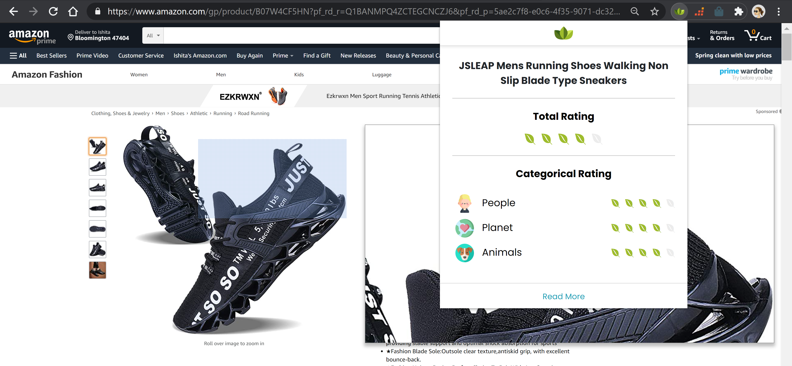

# SustainableConsumption
 

## Getting Started

These instructions will get you a copy of the project up and running on your local machine for development and testing purposes. I will soon set up  deployment mode. Notes on how to deploy the project on a live system will be coming soon!

### Prerequisites

For development, you will only need Node.js, python and flask installed on your environement. And please use the appropriate Editorconfig plugin for your Editor (not mandatory).
These packages are really easy to install & now include NPM. You should be able to run the following command after the installation procedure below.

Check for nodejs:

```
$ node --version
v0.10.24

$ npm --version
1.3.21
```


### Clone

Clone this repo to your local machine using 
```

git clone https://github.iu.edu/SoCo/SustainableConsumption.git

```

### Installing libraries


```
$ git checkout extension_scripts 
$ cd Front_end
$ npm install

```

### Enabling Chrome extension

- Make sure you have the most updated chrome version
- Do not use the incognito mode for testing purposes
- On your browser, Go to chrome://extensions/ and check the box for Developer mode in the top right.
- Click the Load unpacked extension button and select the inside of the Front_end folder for your extension to install it.
- You should be able to see the extesnion unloaded onto your extensions page. Enable it witht he toggle button on the lower right hand side of the extension tab. 
- On your URL search bar, pin the Amazon Ratings extension so that it is now visible on the URL bar.


### Run the Back End

You might have to install dependecies (Flask, Selenium, pandas, numpy). Install it with my requriements.txt in Back_end

``` 
cd Back_End/mainapi
pip install -r requirements.txt
cd ..
cd scraperapi
pip install -r requirements.txt
```

For running the  Back End of the chrome extension, when you are in the root folder of the cloned git repo:


``` 
cd Back_End/mainapi && python api.py 
```
Go on a new terminal and paste the following: 

``` 
cd Back_End/scraperapi && python scrapreapi.py
```
### Testing on Amazon products 

- Go to https://www.amazon.com/
- Do not do this on incognito mode for testing purposes
- Type in a product name on the search bar and go to the product page
- Important: Wait for the product to completely finish loading 
- Click on the green Amazon rating extension Icon and wait for about a minute for the rating to compute. An external popup will open that scrapes the data. This is normal.


## Contribute :+1:

I would love to receive any feedback on the following:  
Please use this form to record your Feedback : [Link](https://forms.gle/dE7UCvcLH7g3a4Wq9)  OR use the issues section within github!


- Installation issues (For this,please contact me on ishkumar@iu.edu or slack me and I will make sure to respond asap!)
- Overall comments on the Chrome Extension 
- Bugs - Description, Steps to Reproduce, Expected and Actual Result
- UI Issues - Sizing, Spelling Mistakes, Colors, Icons, Broken Links etc
- New Suggestions (I love feedback!) :raised_hands:
- Design error
- Documentation issue

## Built With

- [Python](https://nodejs.org/en/)
- [Flask](https://reactjs.org/ )
- [Bootstrap](https://getbootstrap.com/ )
- [Vanilla JS](https://getbootstrap.com/ )

## About me :raising_hand:

- **Ishita Kumar**: I am  final year Masters student, studying Computer Science and specializing in Software/Frontend Engineering. I like sushi and bubble tea.

   [](https://www.linkedin.com/in/ishitakumar96)
   [](https://github.com/ishita-kumar)
